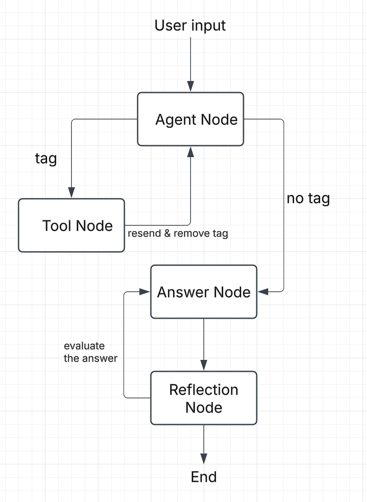

# README

## Start
cmd:
```uvicorn main:app --reload```

## Branches
- **master branch**: latest version
- **agentic-trial branch** : a knowledge base demo based on Agentic RAG
- **langgraph-trial branch** : a knowledge base demo based on LangGraph & Agentic RAG
- **langgraph-v1 branch** a knowledge base demo based on LangGraph & Agentic RAG with 3 nodes

## Structrue
- `functions.py`: Ingestion functions & Retrival functions
- `lg.py`: LangGraph Agent
- `models.py`: import GOOGLE AI models
- `main.py`: FastApi Entrance
- `.env`: save GOOGLE api key

## LangGraph Structure

