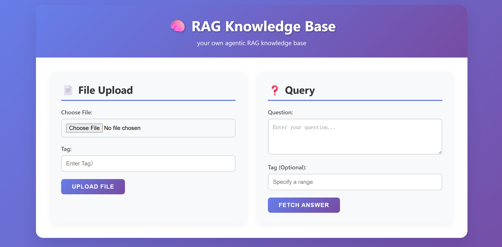

# README

## Features
A Personal Agentic RAG Knowledge Base
- **file upload** : upload txt file and optionally tag it
- **query** : query the knowledge base and optionally add a tag
- **agent thinking process** : show the work process of the agent

## Start
backend: `uvicorn main:app --reload`

frontend link : https://github.com/Stella0233/demo_frontend

frondend: `python -m http.server 3000`

## Branches
- **master branch**: latest version
- **agentic-trial branch** : a knowledge base demo based on Agentic RAG
- **langgraph-trial branch** : a knowledge base demo based on LangGraph & Agentic RAG
- **langgraph-v1 branch** : a knowledge base demo based on LangGraph & Agentic RAG with 3 nodes
- **reflection_node branch** : reflection node is added to the system

## Structrue
- `functions.py`: Ingestion functions & Retrival functions
- `lg.py`: LangGraph Agent
- `models.py`: import GOOGLE AI models
- `main.py`: FastApi Entrance
- `.env`: save GOOGLE api key
- `filename.py`: tool script for file uploading
- `logger.py`: for debugging

## LangGraph Structure

